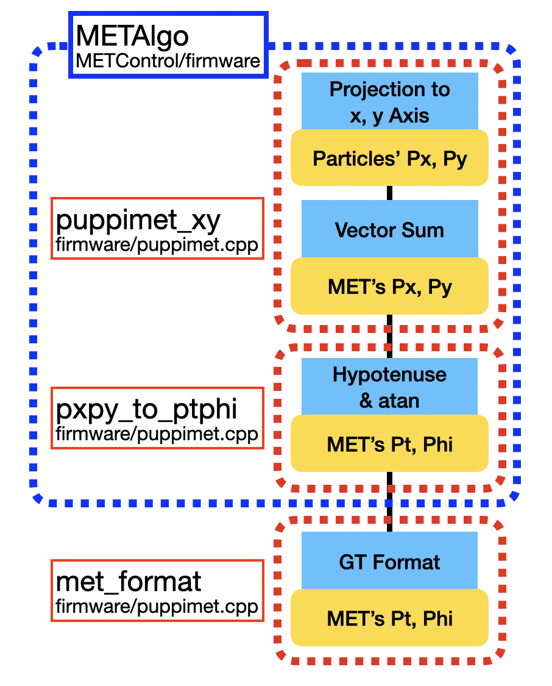

# L1 MET

<p align="center">
    
</p>

- `METAlgo` Architecture

This block directly receives 128 PUPPI candidates, and produces a MET object.

## Simulation
This repository provides the full workflow to simulate the L1 PUPPI MET hardware design using Vitis HLS and compare the results against the reference results.
The setup includes:
- Running the C testbench in Vitis HLS
- Comparing the hardware result with REF output
- Producing a HLS MET output text file
- Synthesize all HLS MET algorithms

### 1. Compare the HLS Output with Reference

The C testbench compares between REF result and HLS MET output.
```
vitis_hls -f run_Sim.tcl "{nevents=1000 write=1 debug=1 verbose=1}"
```

### 2. Run HLS Synthesis for All MET Algorithms
```
vitis_hls -f run_PuppiMETxy.tcl
vitis_hls -f run_PxPyToPtPhi.tcl
```


